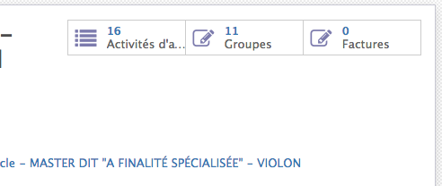

:banner: banners/accounting.jpg

=========================
Gestion de la facturation
=========================

Assigner un mineral
-------------------

Chaque étudiant est inscrit au travers d'un ou plusieurs *Programmes annuels* pour
lesquels un minerval est dû.

Dans la fenêtre du *programme annuel*, un bouton situé en haut à droite de la
fiche renseigne si une facture a été émise correspondant à ce programme.

Ce bouton a pour action de créer la facture si elle n'existe pas ou de l'afficher
si elle existe déjà.

Toutes les factures sont crées avec une date de facturation au 15/09 de l'année
correspondante, avec des échéances de paiement *standard* soit

* 10% pour le 31 octobre
* le solde pour le 04 janvier

La facture en brouillon peut être imprimée et/ou envoyée par email à l'étudiant.

La facture définitive pourra être imprimée ou envoyée par email une fois qu'elle 
a été approuvée par la comptabilité.

Il existe quatre filtres sur les *Programmes annuels* pour retrouver 
* les programmes à facturé
* les programmes facturés
* les programmes en attente de paiement
* les programmes payés

Validation de la facture
------------------------

La comptabilité a la responsabilité de contrôler la facture et de la valider.

Une fois validée, la facture ne peut plus être modifiée et un numéro unique lui
est assigné.

Les dates de paiement attendu sont fixées et elle est irrévocablement 
comptabilisée.

Encodage d'un paiement
----------------------

L'encodage d'un paiement sur une facture se fait à l'aide du bouton 
*Enregistrer un paiement* où la date est spécifiée ainsi que le montant reçu.

La méthode de paiement *Banque* ou *Liquidité* peut aussi être encodé.

Lorsque le solde de la facture est payé, celle-ci est automatiquement renseignée
comme payée.

