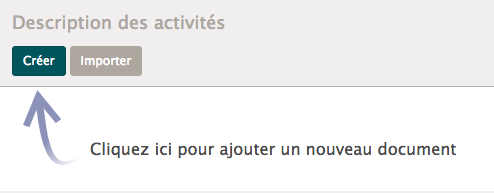
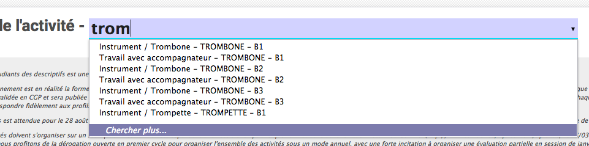

:banner: banners/descriptif.jpg

=========================
Descriptifs des activités
=========================

L’écran « Description des activités » donne accès aux descriptifs des activités 
d’apprentissage. Cet outil vous permet d’encoder les descriptifs, de les 
consulter et de les imprimer.

Ajout d'un descriptif
---------------------

Lors de la création d’un nouveau descriptif, il faut sélectionner l’activité 
d’apprentissage auquel il se rapporte.

Pour cela, vous pouvez commencer à taper le nom de l’activité et le sélectionner 
dans la liste. Le menu “Chercher plus…” ouvre une fenêtre de dialogue dans 
laquelle vous pouvez affiner la recherche.

Une fois l’activité sélectionnée, les champs prédéfinis sont remplis (ECTS, 
heures,...) et vous pouvez commencer à compléter les sections relatives à votre 
activité.

S’il y a une remarque à faire quant à l’activité ou son organisation, un champs 
remarque est disponible, celui-ci ne sera pas publié et est réservé pour la 
consultation par le personnel du Conservatoire.
